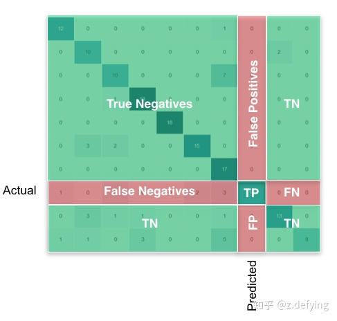

# Python3

## 内置数据类型

### 列表(list)

```python
x=[1,2,3]
# 切片
x[1:2]
```

#### 方法

- append()

  ```python
  x=[]
  x.append(114514)
  ```


### 集合(set)

```python
s={1,2,3,4,5}
```

#### 方法

- 交集、并集、差集

  ```python
  s1={1,2,3,4}
  
  s2={2,4,5}
  s1-s2=={1,3}
  s1|s2=={1,2,3,4,5}
  s1&s2=={2,4}

### 字符串(str)

#### 字符串前缀

- r"imiwakanai"

  raw，不转换转义字符。

- b"something"

  ascii，编码方式。

- f"string"

  fomat。

- u"string"

  unicode。

#### 格式化字符串

```python
s1="{1} {0}.".format("world","hello")
s2="{} {}.".format("hello","world")
s3="{a} {b}.".format(a="hello",b="world")
s1==s2
s2==s3
s1==s3
```
## NumPy库

### 类

#### numpy.array

- 构造

    ```python
    # 表示一个列向量
    np.array([1,2,3])
    # 表示一个矩阵
    # [1,2,3],
    # [4,5,6],
    # [7,8,9],
    # 第一列为1,4,7
    np.array([[1,2,3],[4,5,6],[7,8,9]])
    ```
    
- 成员属性

    - T

      转置矩阵。

      ```python
      np.shape(x)=(3,4)
      # 返回x的转置矩阵
      x.T
      ```

- 列向量转换为行向量

    ```python
    a=[[1],
       [2],
       [3],
       [4],]
    b=a.ravel()
    b==[1,2,3,4]
    ```

    

### 常用方法

#### np.loadtxt()

- 指定变量类型

    ```python
    np.loadtxt("file",dtype=str)
    ```

- 跳过前n行

    ```python
    np.loadtxt("file",skiprows=n)
    ```

- comment

  指定符号之后的作为注释而不读取。

  ```python
  np.loadtxt("file",comment='*')
  ```

- delimiter

  分隔符。

  ```python
  np.loadtxt("file",delimiter=',')
  ```

- usecols

  只使用指定列。

  ```python
  # 只使用第0列和第2列。
  np.loadtxt("file",usecols=(0,2))
  ```

- converters

  预处理函数。

  ```python
  def func(x):
  	return int(x)+1
  # 表示对第3列使用func函数处理。
  np=np.loaadtxt("file",converters={3:func})
  ```

#### np.split()

```python
# sections表示平均分组数
# indices用元组(x1,x2,...)表示，表示沿着x1,x2切一刀，[xn]元素在刀的右边。
# axit表示沿什么方向切割，0表示横向，1表示纵向
# arr表示一个矩阵
np.split(arr,indices_or_sections,axis)

x=np.array([1,2,3,4])
# a=[1], b=[2,3,4]
a,b=np.split(x,(1,)) # x[1]被分配到数组b。
```

#### np.shape()

返回矩阵的形状。

```python
# x为n行m列矩阵
np.shape(x)=(n,m)
```

#### np.append()

返回附加后的数组，不改变原数组。

```python
x=[1,2,3]
x=append(x,5)
```

## SkLearn库

### sklearn.model_selection类

数据集采样相关类。

#### train_test_split()

```python
# x为特征矩阵，一个行向量对应一个样本；yi为该行样本的标签。
X_train, X_test, y_train, y_test = train_test_split(x,y,random_state=1,train_size=0.6,test_size=0.4)
```

- ramdom_state

  随机数种子，同一个种子生成的随机数相同。int类型。

#### KFold()

可能是迭代器？用于K折交叉验证。迭代返回用于K折交叉验证的索引（index）列表。

```python
import sklearn.model_selection as slt
for train_index, test_index in KFold(n_splits=n).split(X):
    # train_index为索引列表。
    X_train, y_train=X[train_index], y[train_index]
    X_test, y_test=X[test_index], y[test_index]
```


### sklearn.svm类

支持向量机。

#### svm.SVC()

返回一个SVC生对象。

- C 

  平衡软间隔。默认值是1.0。

- kernel 

    默认为'rbf'。‘linear’（线性核）， ‘poly’（多项式），‘rbf’（高斯核），‘sigmoid’（双曲正切核），‘precomputed’（自定义核函数）。

- degree 

    多项式poly函数的维度，默认是3。

- gamma 

    ‘rbf’，‘poly’ ，‘sigmoid’ 的核函数参数。默认会选择1/n_features。

- coef0 

    核函数的常数项。对 ‘poly’、‘sigmoid’ 有效。


- tol 

    停止训练的误差值大小，默认为1e-3。

- decision_function_shape 

    使用svm进行多分类的参数。

    ‘ovo’（一对一）,  ‘ovr’（一对多）, None。默认为None。

    

- random_state 

  数据洗牌时的种子值，int类型。

- cache_size 

  核函数cache缓存大小，默认为200

- class_weight 

    类别的权重，字典形式传递。设置第几类的参数C为weight\*C(C-SVC中的C)

- verbose 

    允许冗余输出。

- max_iter 

    最大迭代次数。默认为-1（无限制）。

- probability 

    是否采用概率估计。默认为False。

- shrinking 

    是否采用shrinking heuristic方法，默认为true。

#### SVC生对象

未输入数据而参数固定的SVC模型。

- 烤肉

    ```python
    m=svm.SVC()
    # y_train.ravel()为普通列表，x[i]样本对应y[i]的标签。
    m.fit(x_train,y_train.ravel())
    ```

#### SVC熟对象

输入数据完成训练的SVC对象。

- score()

  ```python
  m=svm.SVC().fit()
  # 使用测试集对其进行评分。
  m.score(x_test,y_test.ravel())
  ```

- predict()

  使用模型进行预测。返回一个元素为预测标签的一维数组。

  ```python
  m=svm.SVC().fit()
  pre=m.predict()
  pre==[1,0,0,1]
  ```

### sklearn.metrics类

模型评估相关的类。

- .confusion_matrix()

  返回混淆矩阵。

  ```python
  sklearn.metrics.confusion_matrix(fac,pre)
  ```

  


## OS库

### 方法

#### os.getcwd()

获取当前工作目录。

#### os.chdir()

改变工作目录。

## Random库

### rd.sample()

```python
# 在列表x里面取n个做样本（不重复）。
rd.sample(x,n)
# [x1,x2)
rd.sample(range(x1,x2),n)
```

## Math库

### math.pow()

numpy.power() 只能进行正整数次幂运算。

```python
math.pow(2,-1)==0.5
```


## SeaBorn库

### heatmap()

绘制热力图。

```python
import seaborn as sns
sns.heatmap(matrix,annot=True,cmap="Blues")
```

- annot=False

  True时显示计数值。

- cmap=“Blues”

  热力图颜色。

# 机器学习

## 模型评估

### 混淆矩阵




### 准确率（Precision）

预测正例为真实正例的比例。

P=TP/(FP+TP)

### 查全率（Recall）

真实正例被预测为正例的比例。

R=TP/(FN+TP)

### 正确率（Accuracy）

预测正确的比例。

ACC=(TP+TN)/(TP+TN+FP+FN)

### 综合评价指标（F-Measure）

P、R的加权调和平均。

- F1

  alpha=1

  F1=2\*P\*R/(P+R)
