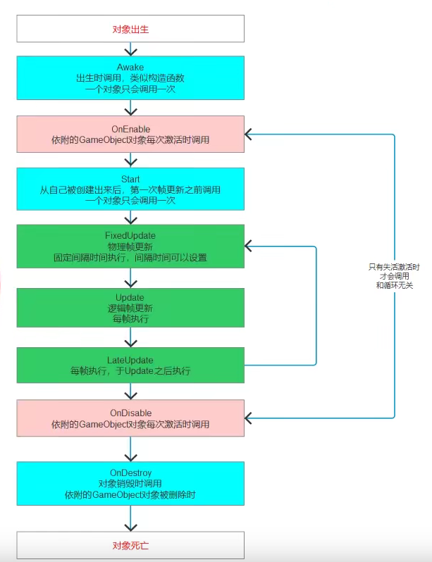

# unity3D备忘

### 名词解释

- 一级父对象

  该对象的上一级对象。

- 世界坐标系

  最高级父游戏对象的坐标系。

- 绝对位置

  在*世界坐标系*的坐标(transform.position)。

- 相对位置

  以一级父对象为参考系的坐标(transform.localPosition)。

### 游戏空间位置描述


z：前进方向。

x：左右方向。

y：竖直方向。

- Vector3类型变量

  Vector3 v=new Vector3();

  1. Vector3.right/up/forward
  
     静态属性。
  
     以*主世界坐标系*的原点为原点的向量(1,0,0)/(0,1,0)/(0,0,1)。
  
  2. v.x/y/z
  
     成员属性。
  
     对应*主世界坐标系*的坐标。
  
  

### Time类

- 时间缩放（游戏暂停）

  Time.timeScale=1;						//时间缩放比例
  
- 帧间隔时间（计算路程）
  
  Time.deltaTime;							//最近一帧消耗的时间
  Time.unscaleDeltaTime;			  //不受timescale影响的

  Time.fixedDeltaTime;					//物理更新时间（固定）
  
- 游戏开始至今的时间
  
  Time.time;
  
  Time.unscaleTime;
  
  
  
  

### Transform类

- 作用：物体运动的相关类

- 成员属性/方法

  ```c#
  Transform tf;
  tf=this.transform;
  
  tf.LookAt(Vector3 location);
  //使得该对象的z轴(forward)指向坐标location（绝对位置）。
  tf.Rotate(Vector3 angle);
  //当angle=(p,0,0)，则会使得tf的一级父对象绕x轴旋转p度。
  
  tf.right/up/forward;
  //以该对象坐标系的原点为原点的单位向量。
  
  tf.position;
  //以该对象的一级父对象为参考系的坐标。读写。
  tf.localPosition;
  //相对坐标。读写。
  tf.position.x/y/z;
  //xyz的值。只读。
  
  tf.lossyScale;
  //在世界坐标系的大小。数值上等于localScale.x*所有父对象的localScale.x的乘积
  tf.localScale;
  //姑且认为是衡量大小的单位。
  ```
  
  

### CharacterController类

- 说明：与游戏角色控制相关的类。

- 成员方法：

  ```c#
  CharcterController cc;
  cc.Move(Vector3 motion);
  //使cc所属对象的position+motion。
  ```


### 杂项

- 面板显示的transform坐标是*相对坐标*。

- transform等价于this.transform。

- Vector3.one等价于(1,1,1)。

- 不要通过直接给rotation/localRotation赋值来进行旋转，使用Quaternion类。

- 生命周期函数

  


### Rigidbody类

- 刚体，使物体具有物理特性。

- 于物体物理属性有关的类。

- 成员属性

  ```
  Mass：质量
  Drag：空气阻力，f=kv。实际的D既不是k也不是恒力f。（怪欸）
  AngularDrag：角空气阻力，f=kω。
  Kinematic：使其不受力的影响而具有其他与刚体相关的属性。
  Interpolate：插值运算使运动平滑。
  CollisionDetection：碰撞检测。
  ```

- 成员方法

  ```c#
  Rigidbody rb;
  rb.Addforce(Vector3 force);
  //当force为Transform的向量类型，则会将值转化为Vector3类型，类比伽利略变换。
  rb.AddExplosionForce(float force,Vector3 position,float radius);
  //在position添加一个模拟爆炸的半径为radius的、大小为force的力场，且该立场只会影响刚体rb。
  ```
  
- 恒力脚本

  ConstantForce

- 刚体休眠（休眠时不进行计算）

  rb.IsSleeping();

  rb.WakeUp();

### Collider类

- 与碰撞相关的类。

- 成员属性

  ```
  IsTrigger：忽略物理效果，并执行自定义的碰撞脚本。
  Material：碰撞时的表现方式（视觉）。
  Center：碰撞体中心的相对父对象的位置。
  ```

- 其他特性

  ```
  父对象为刚体时，其子对象的碰撞器均会参与碰撞检测。（组合异形碰撞体的实现）
  ```

### GameObject类

- 游戏对象属性相关的类

  表示游戏场景中的对象

  ```c#
  GameObject obj;
  ```

  

- 成员属性

  ```c#
  this.gameObject.activeSelf;	//激活
  this.gameObject.name;
  this.gameObject.layer;
  this.gameObject.tag;
  ```

- 静态方法

  ```c#
  //创建游戏对象
  GameObject.CreatePrimitive(PrimitiveTye.Cube);
  
  //寻找场景上的对象，只能找到激活的对象，且仅能找到一个。
  GameObject.Find("ObjectName");
  GameObject.FindWithTag("TagName");
  //寻找objects，多个对象。
  GameObject.FindGameObjectsWithTag("TagName");
  
  //创建对象(克隆)
  GameObject.Instantiate(Obj);
  //删除对象或脚本（同步移除，添加移除标记）
  GameObject.Destroy(Obj);			//至少在一帧之后。
  GameObject.Destroy(Obj,float delaytime);
  GameObject.DestroyImmediate(Obj);	//立即删除，异步。
  //过场景时不删除某对象（通过挂载脚本实现）
  GameObject.DontDestroyOnLoad(Obj);

- 成员方法

  ```c#
  //获取对象继承的脚本
  obj.GetComponent<ScriptName>();
  


### 碰撞检测

- 碰撞发生条件

  至少有一个为刚体。必须都要有碰撞体。


- 检测函数与Collision类的补充

  ```c#
  public class Class:MonoBehaviour()
  {
      private void OnCollisionEnter(Collision obj)
      {
          print(obj.gameObject.name);
          //obj表示被动方。
      }
      private void OnCollisionExit(Collision obj)
      {
          
      }
      private void OnCollisionStay(Collision obj)
      {
          
      } 
  }
  ```

  

